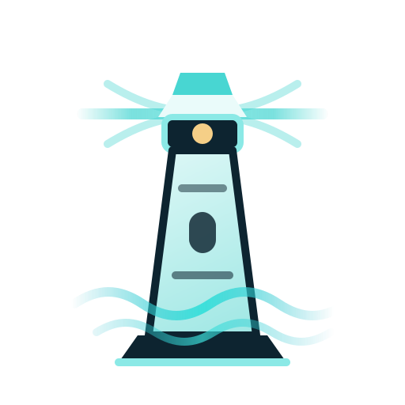

<p align="center">
  
</p>

<p align="center">
  <strong>A Go-native runtime for durable, steerable, event-driven AI agents.</strong>
</p>

<p align="center">
  <a href="https://github.com/hurtener/Harbor/actions/workflows/ci.yml"></a>
  <a href="https://github.com/hurtener/Harbor/releases"></a>
  <a href="https://pkg.go.dev/github.com/hurtener/Harbor"></a>
  
  <a href="LICENSE"></a>
</p>

---

Harbor runs agents the way a server runs requests: as long-lived, observable,
interruptible work — not as a script that blocks until an LLM replies. An agent
in Harbor can be paused mid-reasoning for a human approval, redirected by an
operator, resumed after a process restart, and watched live — all without the
agent's author writing a line of orchestration code.

It ships as one importable Go module and one static binary (`harbor`). No CGo,
no daemon to operate, no message broker to stand up. `harbor dev` boots the
whole runtime on your laptop in under a second.

```bash
go install github.com/hurtener/Harbor/cmd/harbor@v1.0.0

mkdir my-agent && cd my-agent
harbor init                       # tiered harbor.yaml + AGENTS.md/CLAUDE.md/README.md
# edit harbor.yaml — uncomment one LLM provider block + set its API key env var
harbor validate ./harbor.yaml     # fail-loud config check (file:line precision)
harbor scaffold --name my-agent   # materialise the Go project + worked agent + test
harbor dev                        # local runtime + protocol server on :18080
```

---

## Why Harbor

Most agent frameworks are a loop: call the LLM, run a tool, repeat, return a
string. That loop is easy to start and hard to operate. It can't be paused for
approval, it loses everything on a crash, two users share its globals, and the
only way to see what it's doing is to read stdout.

Harbor treats those operational concerns as the product:

- **Durable.** Run state is persisted, not held in a goroutine. A run survives
  a restart; pause/resume serialization fails *loudly* (`ErrUnserializable`)
  rather than silently dropping context.
- **Steerable.** Cancel, redirect, inject a message, pause, resume — nine
  control operations, all routed through one primitive. Human-in-the-loop
  approval, tool-side OAuth, and operator pause are the *same* mechanism.
- **Event-driven.** Every meaningful thing a run does is a typed event on a
  bus. Observability is not bolted on; it is how the runtime is built.
- **Multi-isolation from line one.** Every layer carries a
  `(tenant, user, session)` identity. One user can hold many concurrent
  sessions and they never see each other's state. There is no single-tenant
  mode to "upgrade from."

The reasoning policy is *yours* and it is swappable. Harbor owns the mechanism —
events, tasks, tools, memory, artifacts, pause/resume — behind one `Planner`
interface. The reference ReAct planner ships in the box; a Deterministic planner
ships beside it to prove the seam. Plan-Execute, Graph, and Supervisor planners
are post-V1, and they sit on the exact same primitives.

## Architecture

Harbor is four layers, each with a hard boundary:

| Layer | What it is |
|-------|------------|
| **Runtime** | The orchestration kernel — tasks, planner runtime, tools, memory, sessions, events, skills, artifacts, the unified pause/resume primitive. Headless. |
| **Protocol** | The canonical, versioned event/state contract. Streaming events, the task-control surface, state snapshots, topology, traces, metrics. |
| **Console** | The observability + control-plane UI (SvelteKit). Architecturally just a Protocol client — it never reads a Runtime object directly. |
| **CLI** | The `harbor` binary: `init`, `dev`, `console`, `scaffold`, `validate`, `version`, and the `inspect-*` family. |

Because the Console only ever speaks Protocol, the same surface powers a remote
attach, a third-party dashboard, or an IDE/TUI client. Nothing about
observability is privileged to the first-party UI.

**Persistence** ships as three conformance-equal drivers everywhere it matters
(StateStore, ArtifactStore, MemoryStore, …): in-memory for dev, SQLite
(CGo-free) for single-node, Postgres for scale. **Tools** are transport-agnostic
— an in-process Go function, an HTTP endpoint, an MCP server, or an A2A agent
all register into the same catalog.

## Using Harbor

Build an agent against the runtime library:

```go
import "github.com/hurtener/Harbor/harbortest"
```

The fastest path is the four-step CLI flow: `harbor init` drops a tiered,
commented `harbor.yaml` plus `AGENTS.md` / `CLAUDE.md` / `README.md` companion
files into the current directory; you edit one LLM-provider example block, run
`harbor validate`, then `harbor scaffold --name <name>` to materialise the Go
project (`go.mod`, a worked agent, a `harbortest`-driven test). From there:

- `harbor init` — drop the editable yaml + companion docs. Pick from four
  commented LLM-provider examples (OpenRouter / Anthropic / OpenAI / NVIDIA NIM
  — Bifrost speaks many more; see [`docs/CONFIG.md`](docs/CONFIG.md)).
- `harbor scaffold --name <name>` — materialise the Go project + test pair.
- `harbor dev` — boots the local Runtime + Protocol server, mints an ephemeral
  dev token, serves until you `Ctrl-C`.
- `harbor console` — serves the Harbor Console (baked into the binary) against a
  co-resident Runtime.
- `harbor validate` — runs the config loader against a YAML file with
  file:line-precise errors; suitable as a CI pre-flight.
- `harbor inspect-events` / `inspect-runs` — tail the live event stream or
  reconstruct a run's trajectory from event replay.

The full operator-facing configuration reference for every knob in
`harbor.yaml` lives at [`docs/CONFIG.md`](docs/CONFIG.md); a CI test fails the
build when a new config field lands without a documentation entry.

Worked, runnable examples live in [`examples/`](examples/); copy-paste how-to
guides — defining a tool, wiring a planner, testing an agent — live in
[`docs/recipes/`](docs/recipes/).

### Testing your agent

The public [`harbortest/`](harbortest/) package is a five-function authoring
surface for flow-level tests — `RunOnce`, `AssertSequence`, `AssertNoLeaks`,
`SimulateFailure`, `RecordedEvents`. Import it from outside the module; its
godoc documents the surface and `harbortest/agent_test.go` is the worked
example.

## Documentation

| | |
|--|--|
| [`RFC-001-Harbor.md`](RFC-001-Harbor.md) | The design RFC — product intent and every architectural decision. |
| [`docs/plans/README.md`](docs/plans/README.md) | The master phase plan — how Harbor was built, phase by phase. |
| [`docs/recipes/`](docs/recipes/) | Practical how-to guides, grounded in current APIs. |
| [`docs/CONFIG.md`](docs/CONFIG.md) | Full operator-facing reference for every `harbor.yaml` knob. |
| [`docs/decisions.md`](docs/decisions.md) | The append-only architectural decision log (D-001…). |
| [`CHANGELOG.md`](CHANGELOG.md) | Release history, Keep-a-Changelog format. |

## Status

**Harbor v1.0.0.** The V1 surface is complete: the runtime kernel, the Protocol
and its conformance suite, the ReAct and Deterministic planners, the three-driver
persistence triad, the tool transports (in-proc / HTTP / MCP / A2A), the skills
and memory subsystems, the unified pause/resume primitive, the Console and its
fourteen pages, and the `harbor` CLI. Cross-tenant isolation, goroutine-leak,
and chaos conformance harnesses gate every change.

Post-V1 work — deeper ReAct prompting, additional planner concretes, a durable
distributed bus, governance extensions — is tracked in the master phase plan.

## Releases

A release is built by [`scripts/release-build.sh`](scripts/release-build.sh)
(via `make release-build`, or the `release.yml` workflow on a `v*` tag): a
CGo-free static binary with the version stamped at link time, a SHA-256
checksum, and a SLSA-style build-provenance attestation. `harbor version`
reports the product version and, separately, the Harbor Protocol version.
`make release-dryrun` exercises the whole path without a tag.

## Contributing

[`AGENTS.md`](AGENTS.md) is binding for anyone — human or AI — modifying this
repository. Read it first.

```bash
make help          # every target
make test          # the suite, race detector on
make lint          # the full golangci-lint gate
make preflight     # build + boot + smoke — the same gate CI enforces
make install-hooks # one-time per clone
```

## License

[Apache-2.0](LICENSE). See `RFC-001-Harbor.md` §10 for the rationale.
