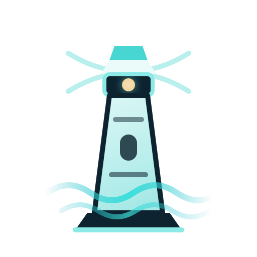

<p align="center">
  
</p>

<p align="center">
  <strong>A Go-native runtime for durable, steerable, event-driven AI agents.</strong>
</p>

<p align="center">
  <a href="https://hurtener.github.io/Harbor/">Docs</a>
  ·
  <a href="#five-minutes-to-a-working-agent">Quickstart</a>
  ·
  <a href="#embed-the-runtime-in-your-own-program">Embedding</a>
  ·
  <a href="#architecture">Architecture</a>
  ·
  <a href="#contributing">Contributing</a>
</p>

<p align="center">
  <a href="https://github.com/hurtener/Harbor/actions/workflows/ci.yml"></a>
  <a href="https://github.com/hurtener/Harbor/releases"></a>
  <a href="https://pkg.go.dev/github.com/hurtener/Harbor"></a>
  
  <a href="LICENSE"></a>
</p>

---

Harbor runs agents the way a server runs requests: as long-lived, observable,
interruptible work — not as a script that blocks until an LLM replies. An agent
in Harbor can be paused mid-reasoning for a human approval, redirected by an
operator, resumed after a process restart, and watched live — all without the
agent's author writing a line of orchestration code.

It ships two ways, and they are the same runtime:

- **A Go SDK.** `go get github.com/hurtener/Harbor` and assemble the full
  agent stack inside your own program — no CLI, no HTTP listener, no daemon.
  The [`sdk/`](sdk/) facade is the supported public surface, and a standing
  CI gate compiles a scaffolded external agent on every commit so "importable
  from outside" stays true rather than aspirational.
- **A static binary.** `harbor` drives the local dev loop, validation,
  scaffolding, and the Console. CGo-free, no message broker to stand up;
  `harbor dev` boots the whole runtime on your laptop in under a second.

External Go control-plane and UI clients use the curated
[`sdk/protocolclient`](sdk/protocolclient/) facade. It provides one
concurrent-safe authenticated REST/SSE client with typed Protocol errors,
identity-aware token resolution, immutable session clones, strict bounded
decoding, and resumable event cursors. Static tokens are principal-bound, so a
multi-session client supplies a `TokenSource` that resolves credentials for the
requested identity rather than reusing one session's JWT. The
stock `inspect-events`, `inspect-runs`, and `inspect-topology` commands use the
same implementation.

## Embed the runtime in your own program

```go
import (
    _ "github.com/hurtener/Harbor/sdk/drivers/prod" // production driver registrations

    "github.com/hurtener/Harbor/sdk/assemble"
    "github.com/hurtener/Harbor/sdk/config"
)

cfg := config.Defaults()
cfg.LLM.Provider = "openrouter"
cfg.LLM.Model = "anthropic/claude-sonnet-4"
cfg.LLM.APIKey = "env.OPENROUTER_API_KEY" // env-var indirection — never inline a key

if err := cfg.ValidateCore(); err != nil {
    return fmt.Errorf("config: %w", err) // fail loud before anything boots
}

stack, err := assemble.Assemble(ctx, cfg, assemble.Options{})
if err != nil {
    return fmt.Errorf("assemble: %w", err)
}
defer stack.Close(ctx)
```

One call composes the dependency-ordered stack — stores, event bus, LLM
client, memory, skills, tasks, tool catalog, sessions, pause coordinator,
planner, run loop — with reverse-order closers and partial-failure cleanup.
Register your own tools via `assemble.Options.PreRegisterTools`, then turn a
goal plus the `(tenant, user, session)` identity into an answer envelope in
one blocking call with `stack.RunOnce` (add `WithStream` for live token / tool
/ step events on the same call). Want a typed answer instead of a string? Pass
`WithOutputSchema` for a schema-validated `answer_payload`, or
`assemble.RunTyped[T](ctx, stack, goal, id)` to get the answer unmarshaled
straight into your Go type. The complete worked path is the
[Embed Harbor headless](docs/recipes/embed-harbor-headless.md) recipe; every
snippet in it is executed by an integration test, so it cannot drift from
the real API.

## Five minutes to a working agent

```bash
go install github.com/hurtener/Harbor/cmd/harbor@latest

mkdir my-agent && cd my-agent
harbor init                       # tiered harbor.yaml + AGENTS.md/CLAUDE.md/README.md
# edit harbor.yaml — uncomment one LLM provider block + set its API key env var
harbor validate ./harbor.yaml     # fail-loud config check (file:line precision)
harbor scaffold --name my-agent   # materialise the Go project + worked agent + test
harbor dev                        # local runtime + protocol server on :18080
```

The operator skills in [`docs/skills/INDEX.md`](docs/skills/INDEX.md) walk
this path step by step — `scaffold-a-harbor-agent` → `run-the-dev-loop` →
`drive-the-playground` is the first-five-minutes chain.

## Why Harbor

Most agent frameworks are a loop: call the LLM, run a tool, repeat, return a
string. That loop is easy to start and hard to operate. It can't be paused for
approval, it loses everything on a crash, two users share its globals, and the
only way to see what it's doing is to read stdout.

Harbor treats those operational concerns as the product:

- **Durable.** Run state is persisted, not held in a goroutine. A paused run
  survives a process restart — the pause checkpoints its trajectory, and a
  max-park sweeper reaps what nobody resumes. Pause/resume serialization fails
  *loudly* (`ErrUnserializable`) rather than silently dropping context.
- **Steerable.** Cancel, redirect, inject a message, pause, resume — all
  routed through one primitive. Human-in-the-loop approval, tool-side OAuth,
  and operator pause are the *same* mechanism, not three reinventions.
- **Event-driven.** Every meaningful thing a run does is a typed event on a
  bus. Observability is not bolted on; it is how the runtime is built.
- **Multi-isolation from line one.** Every layer carries a
  `(tenant, user, session)` identity. One user can hold many concurrent
  sessions and they never see each other's state. Identity is mandatory and
  the runtime fails closed — there is no single-tenant mode to "upgrade from."
- **Operationally honest.** Per-tenant governance ceilings (cost, rate,
  max-tokens) enforce rather than advise. Telemetry passes through a
  mandatory redactor — raw tool arguments never reach a log. Heavy content
  is artifact-stubbed before it can leak into an LLM context window.

The reasoning policy is *yours* and it is swappable. Harbor owns the
mechanism — events, tasks, tools, memory, artifacts, pause/resume — behind one
`Planner` interface. The reference ReAct planner ships in the box; a
Deterministic planner ships beside it to prove the seam. Plan-Execute, Graph,
and Supervisor planners are post-V1, and they sit on the exact same
primitives.

## Architecture

Harbor is four layers, each with a hard boundary:

```text
        your Go program                       the harbor binary
   ┌─────────────────────────┐           ┌─────────────────────────┐
   │ sdk/assemble · sdk/...  │           │ harbor dev · scaffold   │
   └───────────┬─────────────┘           └───────────┬─────────────┘
               ▼                                     ▼
   ┌─────────────────────────────────────────────────────────────┐
   │  Harbor Runtime — headless orchestration kernel             │
   │  tasks · planner runtime · tools · memory · sessions        │
   │  events · skills · artifacts · ONE pause/resume primitive   │
   │  every operation scoped by (tenant, user, session)          │
   └───────────────────────────┬─────────────────────────────────┘
                               │  canonical events · state · control
                               ▼
   ┌─────────────────────────────────────────────────────────────┐
   │  Harbor Protocol — versioned wire contract (SSE + REST)     │
   └──────────┬─────────────────────┬──────────────────┬─────────┘
              ▼                     ▼                  ▼
       Harbor Console        third-party client   harbor inspect-*
```

| Layer | What it is |
|-------|------------|
| **Runtime** | The orchestration kernel — tasks, planner runtime, tools, memory, sessions, events, skills, artifacts, the unified pause/resume primitive. Headless. |
| **Protocol** | The canonical, versioned event/state contract. Streaming events, the task-control surface, state snapshots, topology, traces, metrics. |
| **Console** | The observability + control-plane UI (SvelteKit). Architecturally just a Protocol client — it never reads a Runtime object directly. |
| **CLI** | The `harbor` binary: `init`, `dev`, `console`, `scaffold`, `validate`, `skill`, `version`, and the `inspect-*` family. |

Because the Console only ever speaks Protocol, the same surface powers a
remote attach, a third-party dashboard, or an IDE/TUI client. Nothing about
observability is privileged to the first-party UI. Reopening a long
conversation is a first-class read: the `state.history` method serves a
bounded, tail-first window of a session's durable event stream with a
scroll-up cursor, so a client rehydrates the newest turn first instead of
re-streaming the whole history. Its sibling `events.list` widens that read to
a time range across sessions — the same flat rows, the same paging grammar —
so a fleet observability view scrolls the raw event log back over a window
(fleet-wide reads gated on a verified `admin`/`console:fleet` scope).

**Persistence** ships as three conformance-equal drivers everywhere it matters
(StateStore, ArtifactStore, MemoryStore, …): in-memory for dev, SQLite
(CGo-free) for single-node, Postgres for scale. **Tools** are transport-agnostic
— an in-process Go function, an HTTP endpoint, an MCP server, or an A2A agent
all register into the same catalog. A tool that needs a downstream OAuth
credential binds to a provider; alongside the interactive authorization-code
flow, the `tokenexchange` provider pulls that credential from an external
broker via an RFC-8693 exchange keyed on the verified identity triple — one
central grant serves a whole fleet, and brokered tokens are never persisted.
The provider's own client credential resolves from the process env by
default, or — with `credential_source: remote` — is pulled from a
coordinator endpoint at first need, so a credential minted after boot
reaches a running runtime with zero touch and never enters its environment.

## Using Harbor

The fastest path is the four-step CLI flow above: `harbor init` drops a
tiered, commented `harbor.yaml` plus companion docs; you edit one
LLM-provider example block, run `harbor validate`, then
`harbor scaffold --name <name>` to materialise the Go project (`go.mod`, a
worked agent importing the `sdk/` facade, a `harbortest`-driven test). Add
`--with-server` and the scaffold also emits a `cmd/<name>/main.go` that serves
the Protocol from your own binary via the `sdk/server` facade — a scaffolded
agent with compiled in-process Go tools then reaches wire parity with the stock
`harbor serve` (production-only posture; the local-dev loop is
`harbor token keygen` → `identity.jwks_file` → `harbor token mint`). From
there:

- `harbor dev` — boots the local Runtime + Protocol server, mints an ephemeral
  dev token, serves until you `Ctrl-C`.
- `harbor serve` — the production sibling of `harbor dev`: boots the headless
  Runtime + Protocol surface behind a JWKS-backed JWT verifier (your IdP's
  signing keys, via `identity.jwks_url` / `jwks_file`), mints no token, embeds
  no Console. See [`examples/serve.yaml`](examples/serve.yaml).
- `harbor console` — serves the Harbor Console (baked into the binary) against
  a co-resident Runtime.
- `harbor validate` — runs the config loader against a YAML file with
  file:line-precise errors; suitable as a CI pre-flight.
- `harbor skill import <path>` / `harbor skill rm <name>` — ingest a Skills.md
  playbook into the runtime skill catalog (the same store `harbor dev` serves)
  or remove one by name.
- `harbor inspect-events` / `inspect-runs` — tail the live event stream or
  reconstruct a run's trajectory from event replay.

The full operator-facing configuration reference for every knob in
`harbor.yaml` lives at [`docs/CONFIG.md`](docs/CONFIG.md); a CI test fails the
build when a new config field lands without a documentation entry.

Worked, runnable examples live in [`examples/`](examples/); copy-paste how-to
guides — defining a tool, wiring a planner, testing an agent, embedding the
runtime headless, steering and resuming a run, observing an embedded
runtime — live in [`docs/recipes/`](docs/recipes/).

### Testing your agent

The public [`harbortest/`](harbortest/) package is a five-function authoring
surface for flow-level tests — `RunOnce`, `AssertSequence`, `AssertNoLeaks`,
`SimulateFailure`, `RecordedEvents`. Import it from outside the module; its
parameter vocabulary (event buses, identities, tool catalogs, event types) is
constructed through the `sdk/` aliases (`sdk/events`, `sdk/audit`,
`sdk/identity`, `sdk/tools`), so the full surface works externally — the
preflight gate runs an external-module probe against it. The godoc documents
the surface and `harbortest/agent_test.go` is the worked example.

## Documentation

The published docs site at **<https://hurtener.github.io/Harbor/>** renders
the operator skills, recipes, the Protocol adoption track (for third-party
client authors), and the full reference set (configuration, RFC, glossary,
decisions log) with navigation and search. It builds from the canonical files
below — the repo stays the source of truth.

| | |
|--|--|
| [`docs/skills/INDEX.md`](docs/skills/INDEX.md) | Operator skills — Claude-Code-style playbooks for building agents with Harbor. Start at [`scaffold-a-harbor-agent`](docs/skills/scaffold-a-harbor-agent/SKILL.md). |
| [`docs/recipes/`](docs/recipes/) | Practical how-to guides, grounded in current APIs. |
| [`docs/site/protocol/`](docs/site/protocol/) | The Protocol adoption track — build a third-party client against the wire: the executed quickstart, the generated method/event/error/type reference (drift-gated by `make protocol-docs-gen-check`), the five choreography guides (auth, streaming, task control, the pause model, versioning), the worked [event-viewer client](examples/protocol-clients/event-viewer/) (~150 lines, stdlib-only, compile-gated), and the conformance-certification path. |
| [`docs/CONFIG.md`](docs/CONFIG.md) | Full operator-facing reference for every `harbor.yaml` knob. |
| [`docs/notes/productionization-playbook.md`](docs/notes/productionization-playbook.md) | The audit-driven hardening process — how a working agent becomes a production one. |
| [`RFC-001-Harbor.md`](RFC-001-Harbor.md) | The design RFC — product intent and every architectural decision. |
| [`docs/glossary.md`](docs/glossary.md) | Harbor's vocabulary, one entry per term. |
| [`docs/decisions.md`](docs/decisions.md) | The append-only architectural decision log (D-001…). |
| [`docs/plans/README.md`](docs/plans/README.md) | The master phase plan — how Harbor was built, phase by phase. |
| [`CHANGELOG.md`](CHANGELOG.md) | Release history, Keep-a-Changelog format. |

## Status

**Harbor v1.15 Phase 181: Shipped.** Harbor now has a CGo-free Bubble Tea
terminal foundation with semantic dark/light/degraded themes, grapheme-safe
layout, one command and focus model, exact responsive geometry, deterministic
motion, reviewed fixture-state captures, and PTY restoration gates. The command
exists as an honest help-only preview; authenticated attachment lands next.

**Harbor v1.15 Phase 180: Shipped.** A pure Go conversation projection now
hydrates and reconciles canonical history, task, session, pause, posture, and
event state without terminal-framework coupling. It fails visibly on replay
gaps, preserves retention/partiality signals, treats erasure as terminal, and
shares production-path fixtures with the Console so both clients interpret the
same wire events consistently.

**Harbor v1.15 Phase 179: Shipped.** Harbor now has one reusable authenticated
Go Protocol client with identity-aware token resolution, strict REST/SSE
decoding, immutable session attachments, a curated public SDK facade, and the
three shipped `inspect-*` commands as production consumers.

**Harbor v1.12.** Sessions stop displaying as raw ids: a
session now carries an optional **title** (`sessions.set_title`) that a
caller can set on their own or a sibling session of the same
`(tenant, user)` — the wire verb always writes `manual` provenance so a
human-set name can never be silently overwritten by a later auto-namer,
and the title never rides an event payload (`session.title_changed` is
content-free). The Sessions page and Playground switcher both render
title-or-id with an inline rename. And the runtime can now **name a session
itself** — opt-in and default off: enable a `naming` policy (a versioned
agent-config section riding `set_revision`, or a `runtime.naming` yaml fleet
default) and, at each run's terminal boundary, the runtime makes one governed
`Complete` call over a bounded transcript digest and writes an `auto` title —
never overwriting a human's `manual` one, and never on a config-free runtime
(zero counters, zero LLM calls, zero events). A naming failure never alters the
run's outcome and is never silent (`session.naming_failed` carries a stable
error class, never content). One new Protocol method, two canonical events, one
config surface — all additive; the Harbor Protocol holds at `0.1.0`.

**Harbor v1.11.0.** The fleet-and-lifecycle line — the coordinator control
plane grows the surfaces it was missing. An admin observer can enumerate
**tasks and agents across every session** on a runtime: pass
`filter.tenant_ids` on `tasks.list` / `agents.list` under the same verified
`admin` scope claim (a request without it fails loud with `scope_mismatch`,
never a silent narrow), and every widened call is audited. A broker's own
**client credential can be pulled after boot**: set `credential_source: remote`
and the runtime fetches it from a coordinator endpoint at first need — so a
credential minted after the runtime started reaches it with zero touch and the
secret never enters its environment. A runtime-added **MCP connection can now
be removed**, not just paused: `agent_config.remove_mcp_connection` drops the
descriptor as a revision and run-start reconciliation detaches it (rollback
past an add detaches the same way). **Session erasure** now treats its audit
record as part of success — the record-of-fact is durably checkpointed before
the irreversible clear, a record/emit failure fails the delete loud and stays
re-invokable, and deletion counts are cumulative across retries — closing the
paired erasure-integrity issues #409 and #410. And a silent-degradation bug is
closed: agent-config section edits no longer erase a pinned run-completion hook,
with a reflection-backed guard making the omission class impossible to
reintroduce. One new Protocol method,
three canonical events, one config surface — all additive; the Harbor Protocol
holds at `0.1.0`.

**Harbor v1.10.0.** v1.9's typed answers and brokered credentials reach the
Protocol and the MCP wire. Any task can now return a **schema-validated
answer**: pass `output_schema` on the `start` request and the completed
task's envelope carries a validated `answer_payload` — readable via
`tasks.get` and a parent run's AwaitTask observation; schema-invalid after
the correction budget fails the task loud with `output_invalid`, never a
schemaless success. A shared MCP server gets **per-identity credentials and
provenance**: bind an `oauth_provider` to a connection and every call
carries that caller's bearer (fail-closed — a token failure aborts the
call, never an unauthenticated fallback) plus `_meta` attribution
(`agent_id` and operator annotations). Config-declared HTTP tools are live:
`tools.http_manifests` loads UTCP-style manifests at boot, and the existing
by-name OAuth / approval / loading bindings apply to them unchanged. The
new **run-completion hook** (RFC §6.17) delivers every run's full
transcript — mid-run steering messages included — to a named catalog tool
at the terminal boundary, covering the background and disconnected runs no
client observes; a hook failure never alters the run outcome. Tool
**loading modes** become runtime-controllable per agent with one pinned
precedence order, applied next-turn. And governance stops undercounting:
every retry and downgrade attempt now reaches the cost ceilings — recorded
spend rises accordingly, by design. Additive wire types plus two canonical
events; the Harbor Protocol holds at `0.1.0`.

**Harbor v1.9.0.** The typed-output-and-brokered-credentials line. The embed
path now answers in your types: `Stack.RunOnce` takes an opt-in
`WithOutputSchema` and returns a schema-validated object on a new
`answer_payload` envelope key instead of a bare string, or skip hand-authoring
the schema entirely with `assemble.RunTyped[T](ctx, stack, goal, id)`, which
derives it from a Go type and hands back the validated answer already
unmarshaled into `T` — a schema-invalid answer after the retry budget is a
loud `planner.ErrOutputInvalid`, never silent unvalidated text. **Tool
credentials** can now be held in one place for a fleet: the new
`tokenexchange` OAuth driver pulls a downstream tool credential from an
external broker (an orchestrator, a token vault, an STS) via an RFC-8693
exchange keyed on the verified identity triple at token-miss time, TTL-caching
it in memory only and never persisting it — one central grant serves N
runtimes instead of N consents. Two integrity fixes land with it: embedders
should note that `AnswerEnvelope.ToolCallsSeen` now counts *true* tool
invocations (a parallel call of N branches counts N, a task spawn counts 0) —
same JSON shape, new meaning — and session erasure now fails loud when the
event-bus fence fails, deleting nothing rather than reporting success with the
late-event window still open. Purely additive public API plus one canonical
event; the Harbor Protocol holds at `0.1.0`.

**Harbor v1.8.0.** The adopter-path line — all three ways into Harbor now
work end to end. **Embed** it as a library: `assemble.Assemble` composes a
headless runtime and `Stack.RunOnce` turns a goal plus the
`(tenant, user, session)` identity into an answer envelope in one blocking
call, with `WithStream` delivering token / tool / step events as they happen
on the same method. **Scaffold** from the CLI: `harbor init` / `scaffold`
generate an agent whose golden test actually registers and dispatches a tool
through the executor, and `harbor dev` is honest about `.go` edits — it warns
and guides a rebuild rather than reporting a hot-reload that never recompiled.
**Attach over the Protocol**: `harbor serve` verifies JWTs against whatever
JWKS you configure, and for an operator with no identity provider,
`harbor token keygen` / `mint` self-issues the JWTs it verifies — serve's
verifier is unchanged; it trusts the key only because you pointed
`identity.jwks_file` at it. A vendorable TypeScript wire-type generator
(`harbor-protocol-ts-types`) plus worked OIDC and conformance-fork clients
under `examples/protocol-clients/` close the loop for third-party tooling.

Building on the v1.4 production line: a server's tool can declare a `ui://`
resource (`io.modelcontextprotocol/ui`) that the Console renders as an
interactive, sandboxed app inline in the Playground — the **MCP Apps host**,
built on the official `ext-apps` AppBridge in manual-handler mode, so every
app→host call is Protocol-proxied and never escapes the
`(tenant, user, session)` isolation boundary; it ships three display modes
(inline / fullscreen tab / pip split) and inline discovery via the
`mcp.app_available` event. Agents accept image, audio, and video attachments
end-to-end: provider-native upload happens inside the LLM driver, an
attachment-disposition policy keeps heavy bytes out of the context window,
and an opt-in `Embedder` seam adds semantic memory + skill retrieval. And
`harbor serve` — the headless production sibling of `harbor dev` — boots with
no dev-only surfaces, failing loud at boot when a real provider or JWKS
source is missing.

v1.4.1 hardened the MCP Apps backend into a spec-conformant host: the MCP
southbound driver advertises the host's renderable modes during the initialize
handshake through the spec `text/html;profile=mcp-app` UI capability (the
symmetric write side of the existing read path), `runtime.info` carries the
host's display modes for a server to read, and the new
`mcp.apps.tool_context` Protocol method backs durable app tool-context
delivery. On the security side, the steering control surface now derives
caller authority from the *verified* request-context identity and JWT scope
— never the request body — so a request can no longer assert its own
privilege tier, and cross-tenant steering requires the admin scope.
Cross-tenant isolation, goroutine-leak, and chaos conformance harnesses still
gate every change.

Next: the Console-side MCP-Apps data-delivery push — reverted over a
`ui/initialize` handshake regression and tracked for re-land in
[#347](https://github.com/hurtener/Harbor/issues/347) — plus the generated
per-domain Protocol wire-type modules and the shared chat-module extraction
(the D-093 / D-091 follow-ons). On the Protocol-tooling side, `runtime.info`
now also carries a `wire_surface_digest` — a stable `sha256:` fingerprint of
the canonical wire surface (Protocol version, method/error/capability/type
names) that a connected client compares against the digest it was built
against, so coarse wire drift is caught at connect-time instead of
field-by-field at runtime. The Protocol also gains `sessions.delete` — an
identity-scoped, own-session-only data-lifecycle erasure that deletes a
session and cascades deletion of its scoped State, Memory, and Artifacts,
refusing fail-loud on a running task and writing only a redacted,
content-free `session.erased` audit record. Post-V1 work — additional
planner concretes, a durable distributed bus, governance extensions — is
tracked in the master phase plan.

## Releases

A release is built by [`scripts/release-build.sh`](scripts/release-build.sh)
(via `make release-build`, or the `release.yml` workflow on a `v*` tag): a
CGo-free static binary per platform with the version stamped at link time,
SHA-256 checksums, and a SLSA-style build-provenance attestation.
`harbor version` reports the product version and, separately, the Harbor
Protocol version. `make release-dryrun` exercises the whole path without a
tag.

## Contributing

[`AGENTS.md`](AGENTS.md) is binding for anyone — human or AI — modifying this
repository. Read it first.

```bash
make help          # every target
make test          # the suite, race detector on
make lint          # the full golangci-lint gate
make preflight     # build + boot + smoke — the same gate CI enforces
make install-hooks # one-time per clone
```

## License

[Apache-2.0](LICENSE). See `RFC-001-Harbor.md` §10 for the rationale.
